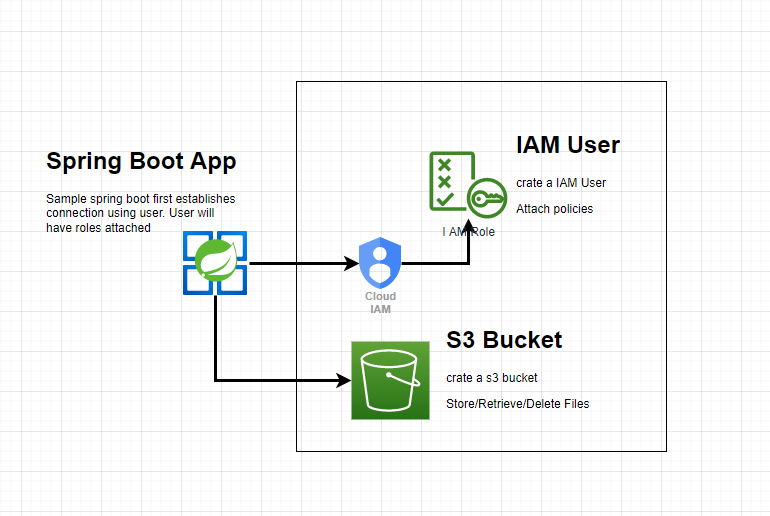
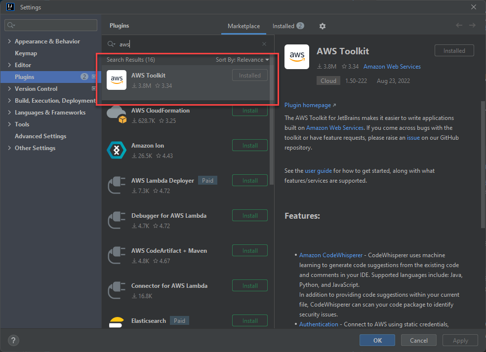
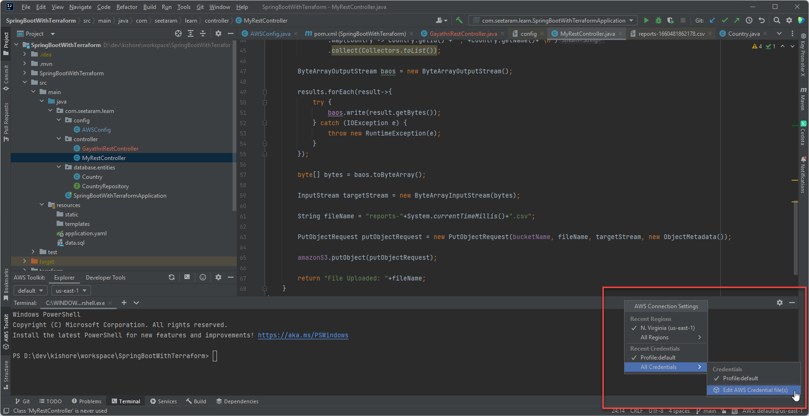
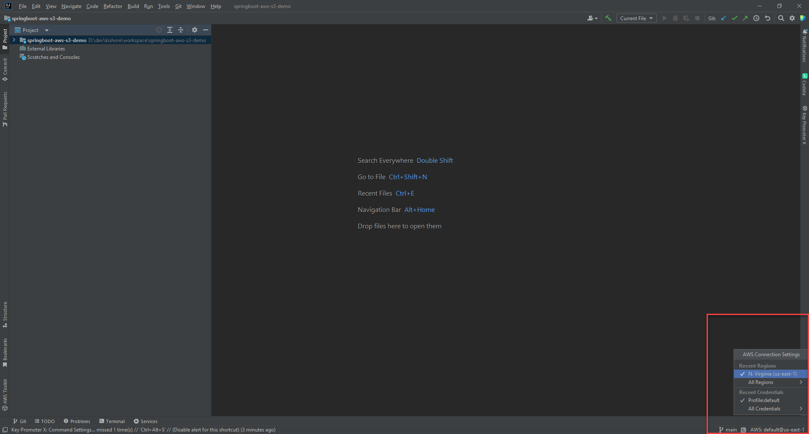

# Amazon S3 with Spring Boot Application
## _today's tasty java bite_

## 1. Introduction
In this sample application, you will learn
- Create an Amazon IAM use with permission to read/write on S3 bucket
- Create/Delete S3 Bucket from CLI and Java
- Retrieve and delete files in S3 Bucket

## 2. Prerequisites
To use this application, we need to have below software and access
- Intellij IDE with AWS plugins
- Java
- Maven
- **AWS account logins**
## 3. Maven Dependencies

We are using spring boot starter parent to include all spring boot related dependencies
```
<parent>
	<groupId>org.springframework.boot</groupId>
	<artifactId>spring-boot-starter-parent</artifactId>
	<version>2.7.2</version>
</parent>
```
Amazon SDK and spring cloud dependency

```
<dependency>
	<groupId>org.springframework.cloud</groupId>
	<artifactId>spring-cloud-aws-context</artifactId>
	<version>2.2.6.RELEASE</version>
</dependency>

<dependency>
	<groupId>com.amazonaws</groupId>
	<artifactId>aws-java-sdk</artifactId>
	<version>1.12.272</version>
</dependency>
```
## 4. Intellij AWS ToolKit Plugin
- Goto File->Settings->Plugins
- Install **AWS Toolkit** plugin


## 5. Select AWS Profile and User credentials
- In bottom right corner, select aws profile

- In bottom right corner, select aws profile

- search for **aws_access_key_id** and replace with IAM User key id
- search for **aws_secret_access_key** and replace with IAM User key id
## 5. Application Configuration
Create Amazon S3 client to interact with S3
```
    @Bean
    public AmazonS3 s3client() {
        AmazonS3 amazonS3Client = AmazonS3ClientBuilder.standard()
                .withRegion(Regions.fromName(region))
                .withCredentials(new ProfileCredentialsProvider("default"))
                .build();
        return amazonS3Client;
    }
```


## AWS SDK CLI

Install [AWS SDK Cli]  
- Update entries in the file C:\Users\<<Current User>>\.aws
- run below command to list all buckets
```
aws s3 ls
```
create S3 bucket
```
aws s3api create-bucket --bucket <bucket unique name> --region <region ex:us-east-1>
```

## License

MIT

**Free Software, Hell Yeah!**

[//]: # (These are reference links used in the body of this note and get stripped out when the markdown processor does its job. There is no need to format nicely because it shouldn't be seen. Thanks SO - http://stackoverflow.com/questions/4823468/store-comments-in-markdown-syntax)

[git-repo-url]: <https://github.com/javabites-gituser/springboot-aws-s3-demo.git>
[AWS SDK Cli]: <https://aws.amazon.com/cli/>